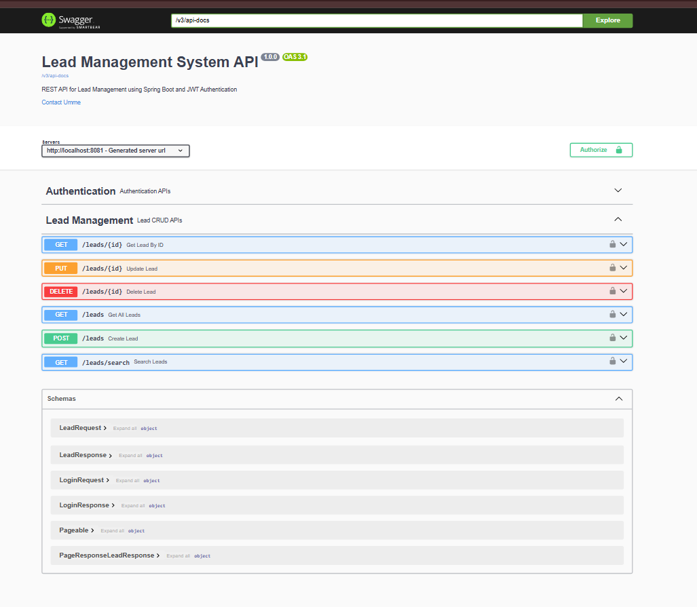
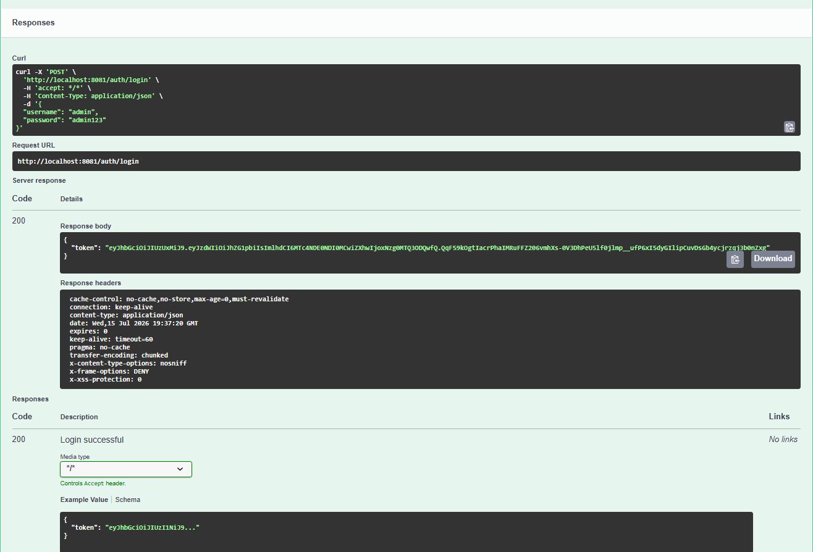
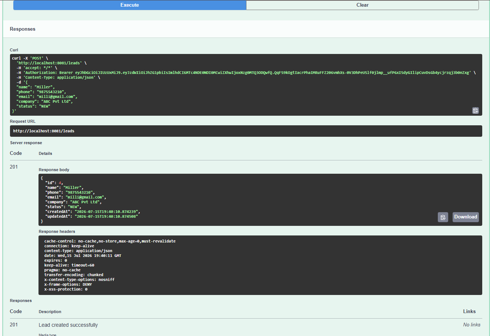
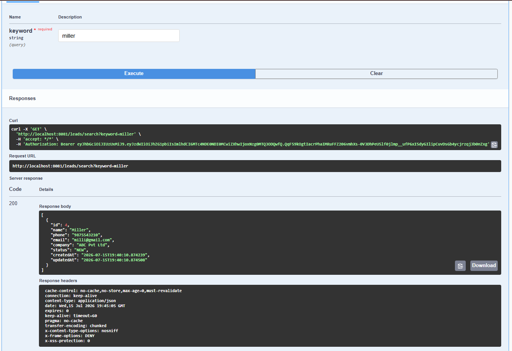
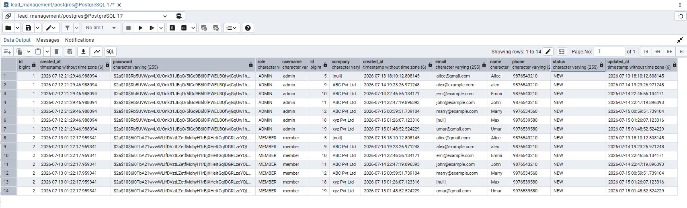
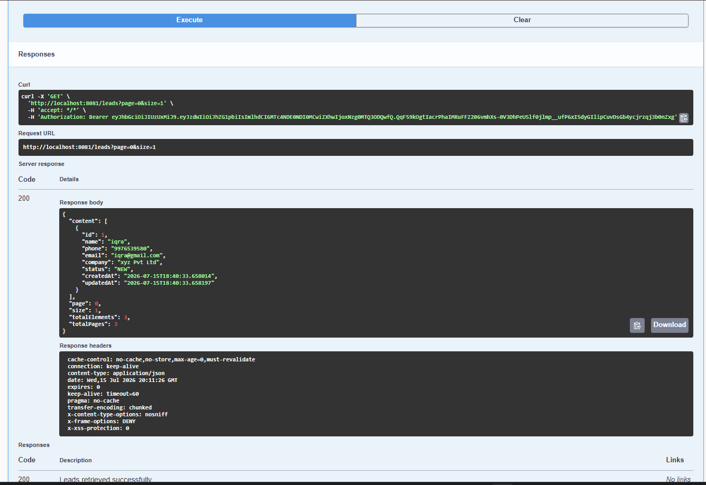

# Lead Management System API


---

## Project Overview

Lead Management System API is a RESTful backend application built with **Spring Boot** for managing customer leads.

The application provides secure JWT authentication, role-based authorization, lead management operations, validation, pagination, search functionality, exception handling, API documentation with Swagger, Docker support, and cloud deployment on Render.

---

## Live Demo

### API Base URL

```
https://lead-management-api-gned.onrender.com
```

### Swagger Documentation

```
https://lead-management-api-gned.onrender.com/swagger-ui/index.html
```

---

## Features

- JWT Authentication
- Role-Based Authorization (ADMIN & MEMBER)
- Lead CRUD Operations
- Search Leads by Name or Phone
- Pagination
- Bean Validation
- Global Exception Handling
- Proper HTTP Status Codes
- Swagger / OpenAPI Documentation
- Docker & Docker Compose
- Environment Variable Configuration
- PostgreSQL Integration
- Cloud Deployment using Render

---

## Tech Stack

### Backend

- Java 17
- Spring Boot 3

### Security

- Spring Security
- JWT Authentication

### Database

- PostgreSQL
- Spring Data JPA
- Hibernate

### Documentation

- Swagger / OpenAPI

### Build Tool

- Maven

### Containerization

- Docker
- Docker Compose

### Deployment

- Render

---

## Architecture

```text
                Client
                   │
                   ▼
            REST Controller
                   │
                   ▼
              Service Layer
                   │
                   ▼
            Repository Layer
                   │
                   ▼
              PostgreSQL
```

---

## Project Structure

```text
src
└── main
    ├── java
    │   └── com.example.leadmanagement
    │       ├── config
    │       ├── controller
    │       ├── dto
    │       ├── entity
    │       ├── enums
    │       ├── exception
    │       ├── mapper
    │       ├── repository
    │       ├── security
    │       ├── service
    │       └── startup
    └── resources
        └── application.properties
```

---

## REST API Endpoints

| Method | Endpoint | Description |
|---------|----------|-------------|
| POST | /auth/login | Authenticate user |
| POST | /leads | Create a lead |
| GET | /leads | Get all leads |
| GET | /leads/{id} | Get lead by ID |
| PUT | /leads/{id} | Update lead |
| DELETE | /leads/{id} | Delete lead |
| GET | /leads/search | Search leads |

---

## Running the Project

### Clone Repository

```bash
git clone https://github.com/Ummehani18/lead_management_API.git
cd lead_management_API
```

---

### Configure Environment Variables

Create a `.env` file.

```text
SERVER_PORT=8080

SPRING_DATASOURCE_URL=jdbc:postgresql://localhost:5432/lead_management
SPRING_DATASOURCE_USERNAME=postgres
SPRING_DATASOURCE_PASSWORD=Postgresql

JWT_SECRET=your-secret-key
JWT_EXPIRATION=3600000

DEFAULT_ADMIN_USERNAME=admin
DEFAULT_ADMIN_PASSWORD=admin123

DEFAULT_MEMBER_USERNAME=member
DEFAULT_MEMBER_PASSWORD=member123
```

---

### Run Locally

```bash
mvn clean install
mvn spring-boot:run
```

---

### Run with Docker

```bash
docker compose up --build
```

Swagger:

```
http://localhost:8081/swagger-ui/index.html
```

---

## Default Users

### Administrator

| Username | Password |
|----------|----------|
| admin | admin123 |

### Member

| Username | Password |
|----------|----------|
| member | member123 |

---

## Testing

The API has been tested using both:

- Swagger UI
- Postman

Test scenarios include:

- Authentication
- Authorization
- CRUD Operations
- Pagination
- Search
- Validation
- Exception Handling
- Production Deployment Verification

---

## Screenshots

### Swagger UI



---

### Login Response



---

### CRUD Operations



---

### Search API



---

### PostgreSQL Tables



---

### Pagination


